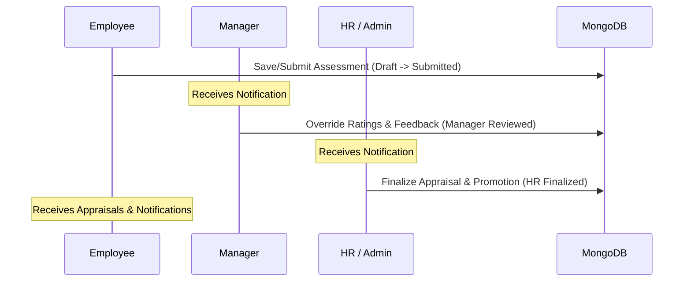

# Employee Performance Management System (MERN + Docker)

This plan details the full implementation of the web-based Performance Management System, supporting role-based access control, employee self-assessments, manager reviews, and HR finalizations.

---

## User Review Required

> [!IMPORTANT]
> **Tailwind CSS Version**: You requested Tailwind CSS for styling. We recommend using **Tailwind CSS v3** as it is highly stable and fully compatible with React. Please let us know if you prefer Tailwind CSS v4 or another version.

> [!NOTE]
> **Performance Score Calculation (1-5 Scale)**:
> - **Employee Self-Rating (40%)**: Average of employee's ratings for the 20 questions.
> - **Manager Rating (40%)**: Average of manager's adjusted ratings for the 20 questions.
> - **System Metrics (20%)**: We will calculate a system metric score from 1 to 5 as follows:
>   - Attendance Score (40% weight): `(Attendance % / 100) * 5`
>   - Projects Score (30% weight): `(min(Projects Contributed, 5) / 5) * 5`
>   - Working Hours Score (30% weight): `(min(Hours Worked, 160) / 160) * 5`
>   - *System Score* = `Attendance Score * 0.4 + Projects Score * 0.3 + Working Hours Score * 0.3`

---

## Proposed Changes

We will set up a MERN stack application inside `d:\CompanyManagement` with the following structure:
- `backend/`: Node.js, Express, MongoDB schemas, JWT auth, seed script, and Dockerfile.
- `frontend/`: React, Tailwind CSS v3, Recharts, and Dockerfile.
- Root: `docker-compose.yml` orchestrating MongoDB, Backend, and Frontend.

### 1. Database Schema (Mongoose)

#### [NEW] [backend/models/User.js](file:///d:/CompanyManagement/backend/models/User.js)
Stores profile, role (`employee`, `manager`, `hr`), manager reference (`managerId`), and performance stats:
- `department`: String (e.g., Engineering, Sales)
- `sickLeaves`: Number
- `paidLeaves`: Number
- `hoursWorked`: Number
- `projectsContributed`: Number
- `attendancePercentage`: Number

#### [NEW] [backend/models/Review.js](file:///d:/CompanyManagement/backend/models/Review.js)
Tracks performance sheets and status transitions:
- `employeeId` (Ref User)
- `managerId` (Ref User)
- `status`: `Draft` | `Submitted` | `Manager Reviewed` | `HR Finalized`
- `ratings`: 20 questions containing:
  - `questionId`: Number
  - `questionText`: String
  - `employeeRating`: Number
  - `employeeComment`: String
  - `managerRating`: Number
  - `managerComment`: String
- `finalRatings`: Array of questions as finalized by HR
- `calculatedScores`: { `employeeAvg`: Number, `managerAvg`: Number, `systemScore`: Number, `finalScore`: Number }
- `hrRemarks`: String
- `appraisalPercentage`: Number
- `promotionRecommended`: Boolean
- `auditTrail`: Array of `{ modifiedBy: Ref User, role: String, timestamp: Date, action: String, details: String }`

#### [NEW] [backend/models/Notification.js](file:///d:/CompanyManagement/backend/models/Notification.js)
In-app notifications for workflow movements:
- `recipientId` (Ref User)
- `senderId` (Ref User)
- `message`: String
- `read`: Boolean

---

### 2. Backend REST API Endpoints

#### Auth Routes
- `POST /api/auth/login` (Returns JWT and user metadata)
- `POST /api/auth/register` (HR only)

#### Review Routes
- `GET /api/reviews/my-review` (Employee gets their current review)
- `POST /api/reviews/save-draft` (Save employee draft)
- `POST /api/reviews/submit` (Submit employee self-assessment)
- `GET /api/reviews/pending-manager` (Manager gets reviews to assess)
- `POST /api/reviews/manager-submit/:reviewId` (Manager submits review)
- `GET /api/reviews/all` (HR retrieves all reviews with search/filter)
- `POST /api/reviews/hr-finalize/:reviewId` (HR finalizes appraisal)

#### Notifications & Stats Routes
- `GET /api/notifications` (Fetch user's in-app notifications)
- `POST /api/notifications/read/:id` (Mark as read)
- `GET /api/users/stats` (Aggregated statistics for dashboards)

---

### 3. Frontend Dashboards & Tailwind Layouts

We will build three main dashboard layouts:
1. **Employee Dashboard**: 
   - Summary statistics cards (leaves, projects, working hours).
   - Form view: Interactive 20-question ratings with slide bars and comment fields.
   - Status tracker (stepper) showing: `Draft` ➔ `Submitted` ➔ `Manager Reviewed` ➔ `HR Finalized`.
2. **Manager Dashboard**:
   - List of direct reports and their submission statuses.
   - Interactive review window side-by-side with employee ratings and comments.
3. **HR Dashboard**:
   - Aggregate statistics widgets.
   - Search/filter bars by department, review status, and score ranges.
   - Comparison console: Side-by-side display of employee, manager, and system scores.
   - Appraisal & Promotion decision panel.

---

## Verification Plan

### Automated Verification
- Verify Docker builds and service connections.
- Run endpoint test scripts to validate status flow:
  `Draft` ➔ `Submitted` ➔ `Manager Reviewed` ➔ `HR Finalized`.

### Manual Testing Flow
1. **Log in as Employee**: Submit 20 questions. Check stats cards and charts.
2. **Log in as Manager**: View employee self-ratings, modify ratings, submit feedback.
3. **Log in as HR**: Compare scores, submit final appraisal percentage/promotion status.
4. **Log in as Employee**: Confirm final appraisal details are visible.
